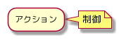

<!-- TOC -->

- [1. クラス図](#1-クラス図)
  - [1.1. 構造](#11-構造)
    - [1.1.1. Class](#111-class)
    - [1.1.2. Class（可視性）](#112-class可視性)
    - [1.1.3. Enum/Interface/Entity](#113-enuminterfaceentity)
  - [1.2. 関連](#12-関連)
    - [1.2.1. 位置関係の指定](#121-位置関係の指定)
    - [1.2.2. 線の種類](#122-線の種類)
      - [1.2.2.1. クラス](#1221-クラス)
      - [1.2.2.2. ER](#1222-er)
  - [1.3. レイアウト](#13-レイアウト)
    - [1.3.1. パーティション](#131-パーティション)
- [2. アクティビティ図](#2-アクティビティ図)
  - [2.1. ノード](#21-ノード)
    - [2.1.1. 開始](#211-開始)
    - [2.1.2. 終端](#212-終端)
    - [2.1.3. 終了](#213-終了)
    - [2.1.4. 制御ノード](#214-制御ノード)
      - [2.1.4.1. 通常の制御](#2141-通常の制御)
      - [2.1.4.2. 受信イベント](#2142-受信イベント)
      - [2.1.4.3. 送信イベント](#2143-送信イベント)
      - [2.1.4.4. 制御ターゲット](#2144-制御ターゲット)
  - [2.2. フロー](#22-フロー)
    - [2.2.1. 条件分岐](#221-条件分岐)
      - [2.2.1.1. if 分岐](#2211-if-分岐)
      - [2.2.1.2. switch 分岐](#2212-switch-分岐)
    - [2.2.2. 非同期処理](#222-非同期処理)
    - [2.2.3. 繰り返し](#223-繰り返し)
      - [2.2.3.1. 後判定](#2231-後判定)
      - [2.2.3.2. 前判定](#2232-前判定)
  - [2.3. レイアウト](#23-レイアウト)
    - [2.3.1. パーティション](#231-パーティション)
    - [2.3.2. レーン](#232-レーン)
- [3. ここから先はまだ使わなそうなので雑においておく…](#3-ここから先はまだ使わなそうなので雑においておく)
  - [3.1. ユースケース図](#31-ユースケース図)
  - [3.2. ステートマシン図](#32-ステートマシン図)
  - [3.3. シーケンス図](#33-シーケンス図)

<!-- /TOC -->

# 1. クラス図

- [もう辛くない！テキストで書く UML クラス図編](https://qiita.com/ykawakami/items/f6688b845945669f0ce5)
- [IT 専科 クラス図](http://www.itsenka.com/contents/development/uml/class.html)
- [PlantUML 　クラス図](https://plantuml.com/ja/class-diagram)

## 1.1. 構造

### 1.1.1. Class


```uml
@startuml
class A {
  id: number
  {static}name: string
  func1()
  {abstract}func2()
  {static}func3()
}
note top of A
    注釈をつける
    位置と対象(class/class::field/class::method())を指定
end note

note left of A::id
    無印/{static}/{abstract}を付加できる
end note
@enduml
```

### 1.1.2. Class（可視性）


```uml
@startuml
class A' {
  +id: number
  -name: string
  #func1()
  ~func2()
}

note bottom of A'
    可視性を表現できる
    "+"	public
    "-"	private
    "#" protected
    "~"	package
end note
@enduml
```

### 1.1.3. Enum/Interface/Entity


```uml
@startuml
enum Enum {
  type1
  type2
  func()
}

interface Interface {
  id: number
  name: string
  func()
}

entity Entity {
    id: INT
    field: VARCHAR
}
@enduml
```

## 1.2. 関連

### 1.2.1. 位置関係の指定


```uml
@startuml
Class -u- Up
Class -r- Right
Class -d- Down
Class -l- Left
note bottom of Class
    線の位置を指定できる
end note
@enduml
```

### 1.2.2. 線の種類

#### 1.2.2.1. クラス


```uml
@startuml
interface Interface {
}

Class01 <|-- Class02 :汎化/継承
Interface <|.. Class02 :実現
Class03 *-- Class04 :コンポジション/構成
Class05 "1" o-- "0..n" Class06 :集約
Class07 .. Class08 :点線
Class09 -- Class10 :実線

note as NOTE
    よく使う線と線のラベル
end note
@enduml
```

#### 1.2.2.2. ER


```uml
@startuml
hide empty members

entity One {}
entity Many {}
entity One_ {}
entity 0_or_Many {}
entity One__ {}
entity One_or_Many {}
entity One___ {}
entity One_Only {}
entity One____ {}
entity Zero_or_One {}

One ||--{ Many :1 : many
One_ ||--o{ 0_or_Many :1 : 0 or many
One__ ||--|{ One_or_Many :1 : 1 or many
One___ ||--|| One_Only :1 : 1 only
One____ ||--o| Zero_or_One :1 : 0 or 1

note as NOTE
    よく使う線と線のラベル
end note
@enduml
```

## 1.3. レイアウト

### 1.3.1. パーティション


```uml
@startuml
package Presentation {
    interface View<<View>> {}
    interface Presenter<<Presenter>> {}
}

package BusinessLogic {
    interface UseCase {}
    class Interactor<<UseCase>> {}
}

package DataAccess {
    class Model<<APIClient>> {}
}

View *-- Presenter
Presenter *.. View
Presenter <- UseCase
UseCase <|.. Interactor
Interactor <- Model

note as NOTE
    パーティションを使って機能やレイヤーを区切る
end note
@enduml
```

# 2. アクティビティ図

- [IT 専科 アクティビティ図](http://www.itsenka.com/contents/development/uml/activity.html)
- [PlantUML アクティビティ図](https://plantuml.com/ja/activity-diagram-beta)

## 2.1. ノード

個々のアクションや条件のことです。

### 2.1.1. 開始


```uml
@startuml
start

note right :開始
@enduml
```

### 2.1.2. 終端


```uml
@startuml
stop

note right :終端
@enduml
```

### 2.1.3. 終了


```uml
@startuml
end

note right
    終了
    使用されたトークンを全て破棄する
end note
@enduml
```

### 2.1.4. 制御ノード

#### 2.1.4.1. 通常の制御



```uml
@startuml
:アクション;

note right :制御
@enduml
```

#### 2.1.4.2. 受信イベント


```uml
@startuml
:受信<

note right :イベントの発生の待機
@enduml
```

#### 2.1.4.3. 送信イベント


```uml
@startuml
:送信>

note right :シグナルを送信する制御
@enduml
```

#### 2.1.4.4. 制御ターゲット


```uml
@startuml
:オブジェクト]

note right :制御のターゲットとなるオブジェクト
@enduml
```

## 2.2. フロー

### 2.2.1. 条件分岐

#### 2.2.1.1. if 分岐


```uml
@startuml
if (条件) then (true)
    :アクション;
else (false)
    :別のアクション;
endif

note right :条件分岐
@enduml
```

#### 2.2.1.2. switch 分岐


```uml
@startuml
start
if (条件A) then (yes)
    :アクション;
elseif (条件B) then (yes)
    :アクション;
elseif (条件C) then (yes)
    :アクション;
else (default)
    :別のアクション;
endif

note right :switch case の場合

stop
@enduml
```

### 2.2.2. 非同期処理


```uml
@startuml
fork
    :アクション;
fork again
    :別のアクション;
end fork

note right :複数の非同期処理
@enduml
```

### 2.2.3. 繰り返し

#### 2.2.3.1. 後判定


```uml
@startuml
start
repeat
  :アクション;
repeat while (繰り返し条件)
stop

floating note right :繰り返し処理（後判定）
@enduml
```

#### 2.2.3.2. 前判定


```uml
@startuml
start
while (繰り返し条件)
  :アクション;
endwhile
stop

floating note right :繰り返し処理（前判定）
@enduml
```

## 2.3. レイアウト

### 2.3.1. パーティション


```uml
@startuml
partition パーティション {
    :アクション;
}

note right :機能や画面単位で区切ると見やすい
@enduml
```

### 2.3.2. レーン


```uml
@startuml
|レーン1|
:アクション;
|レーン2|
:アクション;
:アクション;
|レーン1|
:アクション;
:アクション;
|レーン3|
:アクション;

floating note right :レーンを区切る
@enduml
```

いつ使うかわからない


```uml
@startuml
:???/
:???|
:???}
@enduml
```

# 3. ここから先はまだ使わなそうなので雑においておく…

## 3.1. ユースケース図

```uml
@startuml

actor Promoter
actor Entrant

Promoter --> (Create Event)
Promoter -> (Attend Event)

Entrant --> (Find Event)
(Attend Event) <- Entrant

(Attend Event) <.. (Create Member)  : <<include>>

@enduml
```

## 3.2. ステートマシン図

```uml
@startuml

[*] --> active

active -right-> inactive : disable
inactive -left-> active  : enable

inactive --> closed  : close
active --> closed  : close

closed --> [*]

@enduml
```

## 3.3. シーケンス図

```uml
@startuml

actor Entrant

Entrant -> Ticket : Attend Event Request

activate Ticket
Ticket -> Member : Create Member Request

activate Member
Member -> Member : Create Member
Ticket <-- Member : Create Member Response
deactivate Member

Ticket -> Ticket : Create Ticket
Entrant <-- Ticket : Attend Event Response
deactivate Ticket

@enduml
```
