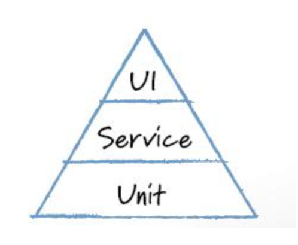
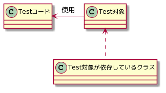
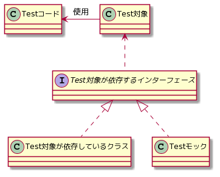

<!-- TOC -->

- [1. テスト全体の話](#1-テスト全体の話)
  - [1.1. なぜ](#11-なぜ)
    - [1.1.1. 自動テストのメリット](#111-自動テストのメリット)
    - [1.1.2. 手動テストのための自動テスト](#112-手動テストのための自動テスト)
  - [1.2. テストピラミッド](#12-テストピラミッド)
  - [1.3. でも時間だってない](#13-でも時間だってない)
    - [1.3.1. もうプロダクトコードがあるときには…](#131-もうプロダクトコードがあるときには)
- [2. テストの実行](#2-テストの実行)
  - [2.1. 全てのテストを実行する](#21-全てのテストを実行する)
  - [2.2. 対象を絞って実行する](#22-対象を絞って実行する)
    - [2.2.1. エディタを使う](#221-エディタを使う)
    - [2.2.2. テストナビゲータを使う](#222-テストナビゲータを使う)
  - [2.3. ランダムに実行する](#23-ランダムに実行する)
- [3. 単体テスト](#3-単体テスト)
  - [3.1. 目的](#31-目的)
  - [3.2. 注意点](#32-注意点)
    - [3.2.1. モック（テストダブル）](#321-モックテストダブル)
  - [3.3. XCTAssertion 一覧](#33-xctassertion-一覧)
  - [3.4. コードサンプル](#34-コードサンプル)
    - [3.4.1. XCTFail](#341-xctfail)
    - [3.4.2. XCTAssertNil](#342-xctassertnil)
    - [3.4.3. XCTAssertNotNil](#343-xctassertnotnil)
    - [3.4.4. XCTAssertEqual](#344-xctassertequal)
    - [3.4.5. XCTAssertNotEqual](#345-xctassertnotequal)
    - [3.4.6. Equatable に準拠する](#346-equatable-に準拠する)
    - [3.4.7. XCTAssertTrue](#347-xctasserttrue)
    - [3.4.8. XCTAssertFalse](#348-xctassertfalse)
    - [3.4.9. XCTAssertGreaterThan](#349-xctassertgreaterthan)
    - [3.4.10. XCTAssertGreaterThanOrEqual](#3410-xctassertgreaterthanorequal)
    - [3.4.11. XCTAssertLessThan](#3411-xctassertlessthan)
    - [3.4.12. XCTAssertLessThanOrEqual](#3412-xctassertlessthanorequal)
    - [3.4.13. XCTAssertThrowsError](#3413-xctassertthrowserror)
      - [3.4.13.1. 例外の内容を検証する](#34131-例外の内容を検証する)
    - [3.4.14. XCTAssertNoThrow](#3414-xctassertnothrow)
  - [3.5. 非同期処理のテスト（XCTestExpectation）](#35-非同期処理のテストxctestexpectation)
- [4. 参考](#4-参考)

<!-- /TOC -->
# 1. テスト全体の話

## 1.1. なぜ

### 1.1.1. 自動テストのメリット

- 早く実行できる
- 何度もくり返し実行できる

```
早いフィードバックを頻繁に受けることができる
コードの問題点にすぐに気づくことができる
```

- 人為的ミスの軽減
- 属人性の排除

```
手動テストで同じことを繰り返すとミスが起きる
当時の開発者がいなくても、仕様を把握できる / リファクタリングができる
```

### 1.1.2. 手動テストのための自動テスト

手動テストで担保するべき範囲がある

- ユーザビリティ
- 探索的テスト
  目的を与えて、テスト設計と実行を各々で繰り返すテスト

```
手動テストのための時間を確保するために自動テストが必要
```

## 1.2. テストピラミッド



[The Forgotten Layer of the Test Automation Pyramid](https://www.mountaingoatsoftware.com/blog/the-forgotten-layer-of-the-test-automation-pyramid)

| 種類       | 内容                                       | テスト量 |
| ---------- | ------------------------------------------ | -------- |
| 単体テスト | 一つのクラス・構造体などに対して行うテスト | 多       |
| 結合テスト | 複数のモジュールを組み合わせて行うテスト  | ↓        |
| UI テスト | UI を操作して行うテスト                | 少       |

ユーザーと同じ操作ができる UI テストを網羅しておけば、全ての機能の品質を担保できるように思えるが、コストがかかる。

- テストの実行時間が長い
- テストが壊れやすい

逆ピラミッド型になっていると、テストは脆く崩れやすいと言われている。（アンチパターン）

## 1.3. でも時間だってない

テストのメリットはわかるが…

- プロダクトコード以外にテストコードを実装する必要がある
- UI や機能を変更したら、テストコードもメンテナンスしないといけない
- テストが失敗したら、自分が変更した箇所以外も調査・修正しなければいけない

テストを捨てる勇気も必要

- 全ての機能を網羅しようとしない
- コードを書いているときに、不安になる箇所だけテストを書く（[不安駆動チェック](https://speakerdeck.com/orgachem/debugging-knowhow-that-improved-our-development-velocity-to-170-percent)）

### 1.3.1. もうプロダクトコードがあるときには…

変更が少なく、重要な機能を優先してテストを実装する

- メンテナンス画面
- アップデート通知
-

# 2. テストの実行

## 2.1. 全てのテストを実行する

`⌘ + U`

## 2.2. 対象を絞って実行する

### 2.2.1. エディタを使う

◇ をクリック
TestCase 単位や Test 単位でのテストの実行を行うことができます。

// TODO: add Image

### 2.2.2. テストナビゲータを使う

テストナビゲータを表示し、▷ をクリック

// TODO: add Image

## 2.3. ランダムに実行する

複数のテストが依存していないことを確認するためには、ランダムにテストを実行する方法があります。

// TODO: add Image
| 手順 |
| -------- |
| |
| |

# 3. 単体テスト

## 3.1. 目的

クラスや構造体などのある 1 つの部品(ユニット)に対するテスト

## 3.2. 注意点

ほとんどの場合、あるクラスは別のクラスに依存している。
例えば、Controller や View は Model に依存している。
Controller や View のテストをするためには、Model が必要になる。
しかし、依存しているクラスを含めてテストすると、テスト対象が不明確になる。



```uml
@startuml
Test対象 <.. Test対象が依存しているクラス
Testコード <-left- Test対象:使用
@enduml
```

### 3.2.1. モック（テストダブル）

この場合、モック(テストダブル)という手法を 使う。
Model をテスト用の偽物のコードに置き換えて、対象のクラスや構造体だけをテストする。



```uml
@startuml
 interface Test対象が依存 {}

 Test対象 <.. Test対象が依存

 Test対象 <|- Testコード:使用

 Test対象が依存 <|.d. Test対象が依存しているクラス

 Test対象が依存 <|.d. Testモック
@enduml
```

## 3.3. XCTAssertion 一覧

| Assert                                         | 説明                                                                                                                                                                                                          | コード例                                                    |
| ---------------------------------------------- | ------------------------------------------------------------------------------------------------------------------------------------------------------------------------------------------------------------- | ----------------------------------------------------------- |
| XCTFail                                        | テストを失敗させる。<br> テストが正しく行われていないケースに入っている場合は失敗させる。                                                                                                                     | [XCTFail](#341-xctfail)                                         |
|                                                |                                                                                                                                                                                                               |                                                             |
| XCTAssertNil                                   | 結果が nil であることを期待                                                                                                                                                                                   | [XCTAssertNil](#342-xctassertnil)                               |
| XCTAssertNotNil                                | 結果が nil でないことを期待                                                                                                                                                                                   | [XCTAssertNotNil](#343-xctassertnotnil)                         |
|                                                |                                                                                                                                                                                                               |                                                             |
| XCTAssertEqual(expression1, expression2)       | expression1 と expression2 が一致することを期待 <br> 引数は Equatable に準拠する必要がある <br> expression1: 実際の値 <br> expression2: 期待値                                                                | [XCTAssertEqual](#344-xctassertequal)                           |
| XCTAssertNotEqual(expression1, expression2)    | expression1 と expression2 が一致しないことを期待 <br> 引数は Equatable に準拠する必要がある <br> expression1: 実際の値 <br> expression2: 期待値                                                              | [XCTAssertNotEqual](#345-xctassertnotequal)                     |
| XCTAssertTrue                                  | 結果が true であることを期待 <br> XCTAssertEqual(expression1, true) でも書けるが、失敗時のログがよりわかりやすくなる                                                                                          | [XCTAssertTrue](#347-xctasserttrue)                             |
| XCTAssertFalse                                 | 結果が false であることを期待<br> XCTAssertEqual(expression1, false) でも書けるが、失敗時のログがよりわかりやすくなる                                                                                         | [XCTAssertFalse](#348-xctassertfalse)                           |
|                                                |                                                                                                                                                                                                               |                                                             |
| XCTAssertGreaterThan(expression1, expression2) | expression1 > expression2 を期待 <br> 引数は Comparable に準拠する必要がある <br> XCTAssertTrue( x > y ) でも書けるが、失敗時のログがよりわかりやすくなる <br> expression1: 実際の値 <br> expression2: 期待値 | [XCTAssertGreaterThan](#349-xctassertgreaterthan)               |
| XCTAssertGreaterThanOrEqual                    | expression1 ≧ expression2 を期待 <br> 引数は Comparable に準拠する必要がある <br> XCTAssertTrue( x ≧ y ) でも書けるが、失敗時のログがよりわかりやすくなる <br> expression1: 実際の値 <br> expression2: 期待値 | [XCTAssertGreaterThanOrEqual](#3410-xctassertgreaterthanorequal) |
| XCTAssertLessThan(expression1, expression2)    | expression1 < expression2 を期待 <br> 引数は Comparable に準拠する必要がある <br> XCTAssertTrue( x < y ) でも書けるが、失敗時のログがよりわかりやすくなる <br> expression1: 実際の値 <br> expression2: 期待値 | [XCTAssertLessThan](#3411-xctassertlessthan)                     |
| XCTAssertLessThanOrEqual                       | expression1 ≦ expression2 を期待 <br> 引数は Comparable に準拠する必要がある <br> XCTAssertTrue( x ≦ y ) でも書けるが、失敗時のログがよりわかりやすくなる <br> expression1: 実際の値 <br> expression2: 期待値 | [XCTAssertLessThanOrEqual](#3412-xctassertlessthanorequal)       |
|                                                |                                                                                                                                                                                                               |                                                             |
| XCTAssertThrowsError(expression, errorHandler) | expression で例外が発生することをチェックする <br> errorHandler 内で例外の内容を検証できる                                                                                                                    | [XCTAssertThrowsError](#3413-xctassertthrowserror)               |
| XCTAssertNoThrow                               | 例外が発生しないことを期待                                                                                                                                                                                    | [XCTAssertNoThrow](#3414-xctassertnothrow)                       |
|                                                |                                                                                                                                                                                                               |                                                             |

## 3.4. コードサンプル

### 3.4.1. XCTFail

```swift
func testMethod() {
    XCTFail()
}
```

### 3.4.2. XCTAssertNil

```swift
let notNumber = Int("Hello") // 数値に変換できずnil
XCTAssertNil(notNumber)
```

### 3.4.3. XCTAssertNotNil

```swift
let number = Int("42") // 数値に変換できInt
XCTAssertNotNil(number)
```

### 3.4.4. XCTAssertEqual

```swift
let string = "Hello"
XCTAssertEqual(string, "Hello") // "Hello"と等しい
```

### 3.4.5. XCTAssertNotEqual

```swift
let string = "Hello"
XCTAssertNotEqual(string, "Goodbye") // "Goodbye"と等しくない
```

### 3.4.6. Equatable に準拠する

```swift
// プロダクトコード
struct User {
    let name: String
    let age: Int
}
```

```swift
// テストコード
class UserTests: XCTestCase {
    func testInit() {
        let actual = User(name: "foo", age: 10)   // 実際の値
        let expected = User(name: "foo", age: 10) // 期待値
        XCTAssertEqual(actual, expected)
    }
}

// プロダクトコードを変更せずに、テストコードのみ Equatable に準拠することも可能
extension User: Equatable {
    static func ==(lhs: User, rhs: User) -> Bool {
        return lhs.name == rhs.name && lhs.age == rhs.age
    }
}
```

### 3.4.7. XCTAssertTrue

```swift
let string = "Hello"
XCTAssertTrue(string.hasPrefix("He")) // "He"から始まる
```

### 3.4.8. XCTAssertFalse

```swift
let string = "Hello"
XCTAssertFalse(string.isEmpty) // 空ではない
```

### 3.4.9. XCTAssertGreaterThan

```swift
// 20 > 10
XCTAssertGreaterThan(20, 10)
```

### 3.4.10. XCTAssertGreaterThanOrEqual

```swift
// 20 >= 10
XCTAssertGreaterThanOrEqual(20, 10)
XCTAssertGreaterThanOrEqual(20, 20) // 等しくてもOK
```

### 3.4.11. XCTAssertLessThan

```swift
// 10 < 20
XCTAssertLessThan(10, 20)
```

### 3.4.12. XCTAssertLessThanOrEqual

```swift
// 10 <= 20
XCTAssertLessThanOrEqual(10, 20)
XCTAssertLessThanOrEqual(10, 10) // 等しくてもOK
```

### 3.4.13. XCTAssertThrowsError

```swift
XCTAssertThrowsError(try throwError()) // throwError()がなんらかの例外をスローすることを期待
```

```swift
enum APIError: Error {
    case sampleError // なにかしらのエラー
    case anotherError  // 他のエラー
}
```

#### 3.4.13.1. 例外の内容を検証する

```swift
// プロダクトコード
struct SampleModel {
    // 例外をスローする可能性がある API リクエスト
    static func fetch() throws {
        // API リクエストの処理...
        if httpStatusCode == 400 {
            throw APIError.anotherError
        }
        if httpStatusCode == 500 {
            throw APIError.sampleError
        }
    }
}
```

```swift
// テストコード
class SampleModelTests: XCTestCase {
    func testFetch() {
        XCTAssertThrowsError(try SampleModel.fetch()) { (error: Error) -> Void in
            // スローされた例外が APIError.sampleError であること
            XCTAssertEqual(error as? DownloadError, APIError.sampleError)
            // XCTAssertTrue(error! is APIError.sampleError)
        }
    }
}
```

### 3.4.14. XCTAssertNoThrow

```swift
XCTAssertNoThrow(try noThrowError()) // noThrowError()がなにも例外をスローしないことを期待
```

## 3.5. 非同期処理のテスト（XCTestExpectation）

非同期処理をテストする場合は、 XCTestExpectation を利用し、処理が完了するまで待機する。
**処理の完了を待機していないと、テストが意図せず成功/失敗してしまう。**

```swift
// プロダクトコード
struct SampleModel {
    // 例外をスローする可能性がある API リクエスト
    static func fetch(@escaping completion: (Result<User, Error>) -> Void) throws {
        // API リクエストの処理...
        // 結果を非同期に返却
        DispatchQueue.main.async {
            completion(.success(user))
        }
    }
}

struct User {
    let name: String
    let age: Int
}
```

```swift
// テストコード
class SampleModelTests: XCTestCase {
    func testFetch() {
        // 処理を待機させる
        let exp: XCTestExpectation = expectation(description: "wait for finish")

        SampleModel.fetch { (result: Result<User, Error>) in
            switch result {
            case .success(let data):
                XCTAssertEqual(data.agentId, 123)
            case .failure(let error):
                XCTFail("error: \(error)")
            }

            // expの待機を解除
            exp.fulfill()
        }

        // exp.fulfill()が実行されるまで、5秒間待機する
        wait(for: [exp], timeout: 5)
    }
}
```

# 4. 参考

- [iOS アプリ開発自動テストの教科書〜XCTest による単体テスト・UI テストから、CI/CD、デバッグ技術まで](https://gihyo.jp/book/2019/978-4-297-10629-4)
- [The Forgotten Layer of the Test Automation Pyramid](https://www.mountaingoatsoftware.com/blog/the-forgotten-layer-of-the-test-automation-pyramid)
- [ iOS アプリの開発速度を 170% に向上させたデバッグノウハウ](https://speakerdeck.com/orgachem/debugging-knowhow-that-improved-our-development-velocity-to-170-percent)
- [UnitTest で自作構造体を比較したい](https://qiita.com/hmhmsh/items/81d8e5c2b2e37dcf7f60)
- [Apple XCTest Document](https://developer.apple.com/documentation/xctest)
